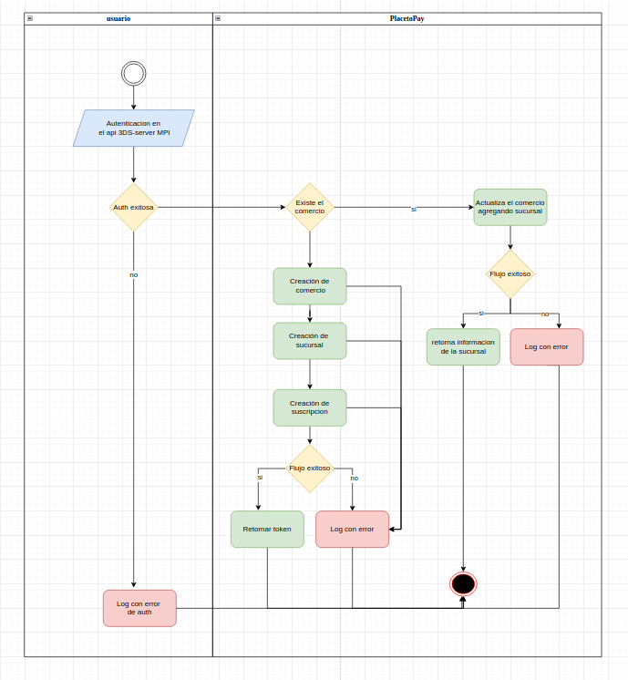
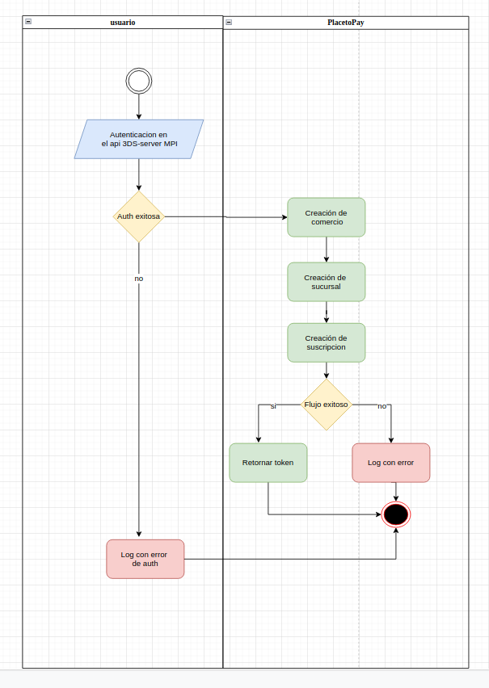

## 3ds MPI Operations

### Scope

 - Created with the purpose of improving the process and streamlining the requirements process in the operations area.

### Usage
### Methods
________________________________________________________
### CreateOrUpdate
________________________________________________________
#### The following parameters are required
- data: one object :: information to process.
  ###### Example: information imported from a file for mass management

        $data =  $data = Data::find('id');
- Required (fields)

Create Merchant

                'name' => 'EGM Ingenieria sin frondteras',
                'brand' => 'placetopay',
                'type' => 'RUT',
                'number' => '123456789-0',
                'url' => 'https://www.placetopay.com',
                'mcc' => 742,
                'isicClass' => 111,
                'nameBranch' => 'Oficina principal',
                'country' => 'COL',
                'currency' => 'COP',
                'franchise' => 1,
                'acquirerBIN' => 12345678910,
                'version' => 2,
                'invitations' => 'larangogon@test.com',
                'merchantID' => null

Update Merchant

                'nameBranch' => 'Oficina principal',
                'brand' => 'placetopay',
                'country' => 'COL',
                'currency' => 'COP',
                'url' => 'https://www.placetopay.com',
                'merchantID' => 1

               

- token: string:: The authentication token which will be generated from the IT area.
######Note: the token must be requested from the area in charge of the PlaceToPay By Evertec
###### Example: 7EuWhiISGug3YW3nVQ99ONS8sO1bCc3UcG7T_php....

__________________________________________________
## Flowchart

______________________________________________________
___________________________________________________________
### createRequest
______________________________________________

#### The following parameters are required
- data: object-Collections :: information to process.
    ###### Example: iinformation imported from a file for mass management

        $data =  $data = Data::all();

- Required (fields)

                'name' => 'EGM Ingenieria sin frondteras',
                'brand' => 'placetopay',
                'type' => 'RUT',
                'number' => '123456789-0',
                'url' => 'https://www.placetopay.com',
                'mcc' => 742,
                'isicClass' => 111,
                'nameBranch' => 'Oficina principal',
                'country' => 'COL',
                'currency' => 'COP',
                'franchise' => 1,
                'acquirerBIN' => 12345678910,
                'version' => 2,
                'invitations' => 'larangogon@test.com'
           

- emailName: string :: Email of the person who will be notified if an error occurs
    ###### Example: larangogon2@gmail.com
- token: string:: The authentication token which will be generated from the IT area.
  ######Note: the token must be requested from the area in charge of the PlaceToPay By Evertec
    ###### Example: 7EuWhiISGug3YW3nVQ99ONS8sO1bCc3UcG7T_php

_________________________________________________________________
#### Update
________________________________________________________
- #### The following parameters are required
- data: object-Collections :: information to process.
  ###### Example: iinformation imported from a file for mass management

        $data =  $data = Data::all();

- Required (fields)

                'nameBranch' => 'Oficina principal',
                'brand' => 'placetopay',
                'country' => 'COL',
                'currency' => 'COP',
                'url' => 'https://www.placetopay.com',
                'merchantID' => 1

- emailName: string :: Email of the person who will be notified if an error occurs
  ###### Example: larangogon2@gmail.com
- token: string:: The authentication token which will be generated from the IT area.
  ######Note: the token must be requested from the area in charge of the PlaceToPay By Evertec
  ###### Example: 7EuWhiISGug3YW3nVQ99ONS8sO1bCc3UcG7T_php

__________________________________

## Mass consumption by means of wires, in parallel 

- By consuming the createRequest method, we start a process which begins with authorization and processing in threads.

data will be divided by chunk of 500 with capacity of 20 threads

- The methods of this library can be overwritten

      abstract protected function chunkInputData($references, string $emailName, string $token);
      abstract protected function authorization($data, string $emailName, string $token);
      abstract protected function emailError($error, string $emailName);
      abstract protected function create($references, string $emailName, string $token);
      abstract protected function request($data, string $emailName, string $token);
      abstract protected function response($response, int $size);
      abstract protected function arrayInsert(array $data, int $size);
      abstract protected function responseUpdate($response);
    

_______________________________________________

## Installation

* composer require larangogon/threeds
* php artisan vendor:publish --tag="threeds-migrations"
* Use model Token: In the Token model: the information resulting from the consumption of createRequest is saved
* php artisan vendor:publish --tag="threeds-config"
* php artisan vendor:publish --tag="threeds-views"
* 
      

## Flowchart

* https://app.diagrams.net/#G1HmtzdPWRD6XUqM7Re7mxbcoajQz9mCbg

